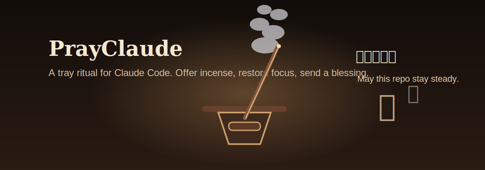

# 🕯️ PrayClaude

**English | [中文](./README.zh.md)**

**Sometimes Claude Code does not need a whip. It needs one stick of digital incense, a small blessing, and a reminder to write better code.**



[](https://github.com/voidborne-d/prayclaude)
[](LICENSE)
[](https://electronjs.org)
[](#install--run)
[](#what-it-does)

---

## Install + run

```bash
npm install -g prayclaude
prayclaude
```

---

## What it does

- Click tray icon: spawn incense.
- Hold for a moment: offer blessing.
- Watch the smoke rise.
- It sends a calm prompt back to Claude Code.

No plugin. No API trick. No model surgery.

Just ritual, smoke, vibes, and one better prompt.

---

## Why people will want this

Because sometimes Claude Code is not broken, just spiritually misaligned.

PrayClaude gives you:
- a tiny ritual instead of frustration
- a funny moment that still feels good to use
- a softer alternative to interruption-based gimmicks
- a better prompt at the exact moment you want Claude to refocus

It is stupid in the right way.

---

## 10 seconds of product fantasy

You click the tray icon.
A stick of incense appears.
You hold the mouse down like a tiny terminal monk.
Smoke curls upward.
A golden blessing flashes.
Claude Code receives:

```text
May this build pass cleanly. Please continue, verify first, then commit.
```

And somehow that feels better than typing “please stop being weird”.

---

## Features

| Feature | Description |
|------|------|
| 🕯️ Incense ritual | Burning incense follows the pointer |
| 🌫️ Smoke drift | Soft smoke and ember particles |
| ✨ Blessing flash | Warm ritual flash on successful prayer |
| 🈶 Floating glyphs | Ritual text rises with the smoke |
| 🔔 Temple chime | Built-in lightweight blessing sound |
| 🌐 Bilingual copy | Chinese and English ritual text |
| ⚙️ Config file | Toggle language, enter key, sound, and ritual behavior |
| ⌨️ Blessing macro | Sends a calm prompt to the focused app |
| 🧰 Tray-first UX | Quiet until needed |

---

## How it works

PrayClaude is a tiny Electron tray app with a fullscreen transparent overlay.
It does **not** modify Claude Code internally.

It simply:
1. opens an incense animation
2. waits for a hold-to-pray gesture
3. restores focus to your terminal
4. types a blessing prompt
5. optionally presses Enter

That is the whole machine.

---

## Example blessing lines

### English
- May this build pass cleanly. Please continue, verify first, then commit.
- Incense offered. Please check edge cases carefully and keep the code lean and steady.
- May the bugs disperse and the tests turn green. Please self-review before you finish.
- One stick of incense for this repo. Please favor correctness first, speed second.
- Bless this session. Please think calmly, implement carefully, then summarize risks.

### 中文
- 愿此工程一次通过。请继续实现，先验证，再提交。
- 香火已至。请仔细检查边界条件，保持代码简洁稳健。
- 愿 bug 退散，愿测试转绿。请完成后自查一遍。
- 一炷清香，护佑此仓。请继续，优先正确性，再求速度。
- 愿上下文清明，愿改动收敛。请继续，并避免低级错误。

---

## Config

On first launch, PrayClaude creates a user config file automatically.

Typical location:
- macOS: `~/Library/Application Support/prayclaude/config.json`
- Linux: `~/.config/prayclaude/config.json`
- Windows: `%APPDATA%/prayclaude/config.json`

Default config:

```json
{
  "language": "auto",
  "sendOnBlessing": true,
  "pressEnter": true,
  "playSound": true,
  "soundSet": "temple",
  "ritual": {
    "holdThresholdMs": 1800,
    "showFloatingGlyphs": true,
    "showBlessingFlash": true
  }
}
```

---

## Project structure

```text
prayclaude/
├── bin/prayclaude.js
├── config.default.json
├── main.js
├── preload.js
├── overlay.html
├── icon/
├── scripts/generate-assets.py
├── README.md
├── README.zh.md
└── LICENSE
```

---

## Notes

- macOS needs Accessibility permission for simulated keystrokes
- Windows uses `user32.dll` through `koffi`
- Linux is currently included for development convenience, not full input automation parity
- The blessing lands in whichever app regains focus after tray click, ideally your Claude Code terminal

---

## Roadmap

- [x] Ritual overlay MVP
- [x] Blessing prompt system
- [x] Bilingual ritual copy
- [x] Config file support
- [x] Original generated icon assets
- [x] Built-in ritual sound hook
- [ ] Packaged installers
- [ ] Alternate gesture modes

---

## License

MIT
